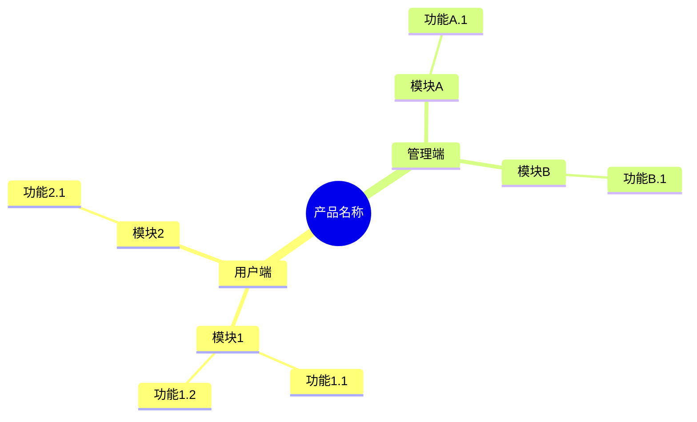
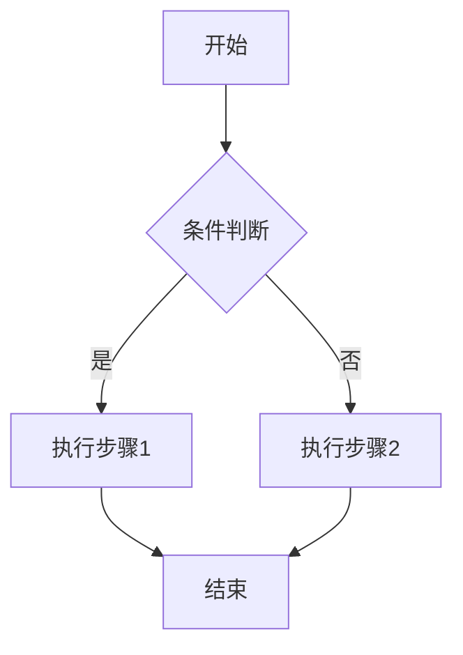

# [项目名称] 产品需求文档 (PRD)

## 1. 文档信息

| 字段 | 内容 |
|-----|------|
| 产品名称 | [产品名称] |
| 文档版本 | V1.0 |
| 编写日期 | [YYYY-MM-DD] |
| 编写人 | [编写人] |
| 最后更新 | [YYYY-MM-DD] |

## 2. 项目背景

### 2.1 业务目标

[描述产品要解决的业务问题和预期目标]

### 2.2 目标用户

| 用户类型 | 用户画像 | 核心诉求 |
|---------|---------|---------|
| [用户类型1] | [年龄/职业/特征] | [核心需求] |
| [用户类型2] | [年龄/职业/特征] | [核心需求] |

### 2.3 核心价值主张

[总结该产品解决的核心问题，用一句话概括产品价值]

## 3. 产品架构

### 3.1 功能架构图

### 3.2 用户角色定义

| 角色名称 | 角色描述 | 主要权限 |
|---------|---------|---------|
| 普通用户 | [描述] | [权限列表] |
| 管理员 | [描述] | [权限列表] |

## 4. 核心业务流程

## 5. 详细功能说明

### 5.1 模块名称

#### 5.1.1 功能名称

| 字段 | 说明 |
|-----|------|
| **功能编号** | [F-01] |
| **功能描述** | [用户可以做什么，达成什么目的] |
| **前置条件** | [使用该功能前需满足的条件] |
| **优先级** | P0/P1/P2 |

**页面元素**：

| 元素 | 类型 | 说明 | 校验规则 |
|-----|------|-----|---------|
| [元素名] | 输入框/按钮/下拉 | [说明] | [校验规则] |

**交互逻辑**：

1. 用户点击[xxx]
2. 系统显示[xxx]
3. 用户输入[xxx]
4. 系统执行[xxx]

**异常处理**：

| 异常场景 | 处理方式 |
|---------|---------|
| [场景1] | [提示/跳转/重试] |
| [场景2] | [提示/跳转/重试] |

---

## 6. 非功能需求

### 6.1 性能要求

| 指标 | 要求 |
|-----|------|
| 接口响应时间 | ≤ 200ms |
| 页面加载时间 | ≤ 3s |
| 并发用户数 | ≥ 1000 |

### 6.2 安全要求

- [ ] 敏感数据加密存储
- [ ] 接口权限校验
- [ ] 防SQL注入/XSS攻击
- [ ] 操作日志记录

### 6.3 兼容性要求

| 维度 | 支持范围 |
|-----|---------|
| 浏览器 | Chrome 80+, Safari 13+, Edge 80+ |
| 设备 | PC, Tablet, Mobile |
| 分辨率 | 1920×1080, 1366×768, 375×667 |

## 7. 迭代规划

| 版本 | 包含功能 | 预计上线时间 |
|-----|---------|-------------|
| MVP | [核心功能列表] | [YYYY-MM-DD] |
| V1.1 | [增强功能列表] | [YYYY-MM-DD] |
| V2.0 | [完整功能列表] | [YYYY-MM-DD] |

## 8. 附录

### 8.1 术语表

| 术语 | 解释 |
|-----|------|
| [术语1] | [解释] |

### 8.2 参考文档

- [相关文档链接]

---

*文档结束*
